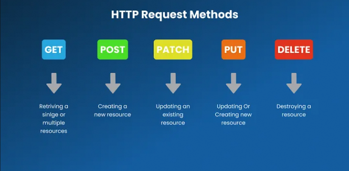

## API METHODS

<p align="center">
  
</p>

HTTP methods, also known as HTTP verbs, are a set of standardized actions that dictate how clients and servers interact with each other over the Hypertext Transfer Protocol (HTTP). They define the type of operation that a client wants to perform on a resource located on a server. Each HTTP method carries a specific meaning and purpose, contributing to the overall functionality and behavior of web applications and APIs

#### Start Server (YARN)
```
-> yarn

-> yarn start
```

#### Start Server (NPM)
```
-> npm install

-> npm run start
```

Here's a description of some commonly used HTTP methods:
 
* **GET**: The GET method is used to retrieve data from a specified resource on the server. It is primarily intended for read-only operations, where the client requests information without causing any modification to the server's state. GET requests are idempotent, meaning multiple identical requests produce the same result as a single request.

* **POST**: POST is employed to submit data to be processed to a specified resource on the server. It is commonly used for creating new resources or executing operations that result in changes to the server's state. Unlike GET requests, POST requests are not idempotent; sending the same request.

* **PUT**: PUT is utilized to update a specified resource on the server with the provided data. It replaces the entire representation of the target resource with the new data sent by the client. PUT requests are idempotent, meaning that sending the same request multiple times has the same effect as sending it once.

* **DELETE**: DELETE is employed to remove a specified resource from the server. It instructs the server to delete the resource identified by the request URL. Similar to PUT requests, DELETE requests are idempotent.

But there are other methods that can be used, these are:

* **OPTIONS**: This method is used to describe the communication options for the target resource. It allows the client to determine the communication options available for a particular resource or the server as a whole.